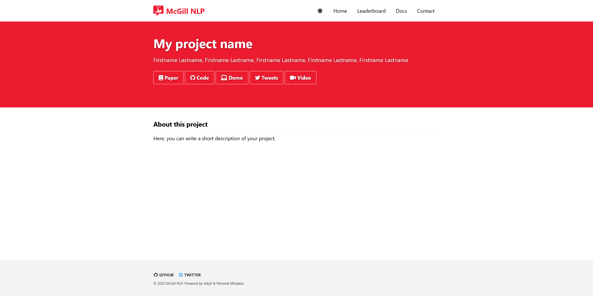

# Project Page Template

This is a project page template for McGill-NLP projects.



## Getting started

You can follow one of the following ways to get started.

### Copy from template

If you have not yet created a repo for your project, you can copy the template from the following link. Simply click on the "Use this template" button, or [click here](https://github.com/McGill-NLP/project-page-template/generate).

### Cloning with git

If you have already created a repo for your project, you can clone the template and copy the files to your project. Let's assume you are in the root of your project directory, e.g. `my-project`.

```bash
cd ..  # Go to parent directory
git clone https://github.com/McGill-NLP/project-page-template
cp -r project-page-template/docs my-project/
cp project-page-template/README.md my-project/docs/
cd my-project/
```

## Activate GitHub Pages

Once the template is copied to your project, you need to activate GitHub Pages for your project.

1. Click on the "Settings" button in the top right corner of the page.
2. Click on the "Pages" tab.
3. In "Source", select branch to be "main" and folder to "/docs".
4. Click on "Save"
5. Go to the "Actions" tab (on the right of "Pull requests" tab) and wait for the action to finish.
6. Visit your project page at mcgill-nlp.github.io/<your-project-name>


### Why `docs/`?

You might be wondering why all the files for the webpage is in `/docs`. Well the page is not really "docs" per se, it's because `github-pages` only allows us to either use the root folder or `/docs`. So we are forced to use the latter in order to clearly separate this page from the rest of the project. Maybe in the future GitHub will allow other names like `/page`, but before then there's nothing we can do... 
  
> Well technically, you *can* push everything to a separate branch, but the original author of this repo is in the school of thought that branches are meant for alternate or historical versions of the `main` branch, or serve as a way to create pull requests. The original author will also vehemently defend this philosophy if one tries to argue otherwise :)
  
But what if you actually want to write some docs for your library? You can just edit `docs/_pages/docs.md`, which is the real page for documentations.
  

## Navigation bar

You can already find links to different pages in the navigation bar. To add, remove, or modify links, you can edit [`docs/_data/navigation.yml`](docs/_data/navigation.yml) file. The `title` corresponds to the text that appear on the navbar, and the `url` corresponds to the relative URL of the page. It is not recommended to include an external URL, as that should be in `/home` page.

## Modifying a page

The files are located in [`docs/_pages/`](docs/_pages/). For example, if you want to modify the `/home` page, you would edit `docs/_pages/home.md`.

All of the pages are markdown files with something called a [front matter](https://jekyllrb.com/docs/front-matter/) at the top, which uses the YAML syntax. Generally, all you need to worry about is the title and the permalink (the latter is the relative URL of the page). In the case of `/home`, you also need to specify external links (`header.actions`) and author names (`excerpt`). However, a template is already provided for you, you only need to modify the content.

## Adding and removing pages

To add a page:
1. Create a new file in `docs/_pages/`, with the desired `permalink` to be your relative URL. So for example, `/contact/` links to `mcgill-nlp.github.io/my-project/contact`.
2. In `docs/_data/navigation.yml`, add a new entry with the `title` and `url` from the previous step.

To remove a page:
1. Delete the file in `docs/_pages/`.
2. In `docs/_data/navigation.yml`, remove the entry with the same `url` as the deleted file.

## Advanced

For any advanced modification, it is recommended to look in the advanced section of the readme of the [group website](https://github.com/McGill-NLP/mcgill-nlp.github.io). Below are a extra tips included for convenience.

### Setup

Please refer to setup instructions in the readme of the [group website](https://github.com/McGill-NLP/mcgill-nlp.github.io).

### Running locally

```bash
cd docs/
bundle exec jekyll serve
```

### Removing dark mode

To remove dark mode, inside [`docs/_config.yml`](docs/_config.yml) file, remove `dark_theme_css`. The dark mode should automatically turn off.

### Updating footer

Inside [`docs/_config.yml`](docs/_config.yml) file, you can modify the footer.

### Modify `excerpt` in a splash page (`/home`)

If you want to modify the excerpt in the `/home` page, you can do so in [`docs/_sass_/splash.scss`](docs/_sass_/splash.scss). Note that `splash.scss` was added specifically for this template, not for the group website.

### Modify or remove icons in splash page buttons

This is handled in [`docs/_includes/page__hero.html`](docs/_includes/page__hero.html). That file was added specifically for this template, not for the group website. You can modify that file to add, modify or remove icons.
